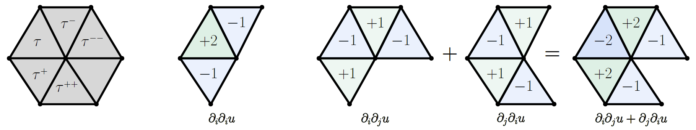

# Mesh Total Generalized Variation for Denoising [[paper](https://ieeexplore.ieee.org/document/9453151)]

<figure></figure>

<!--  -->

 by [Zheng Liu](https://labzhengliu.github.io/), Yanlei Li, [Weina Wang](https://www.researchgate.net/profile/Weina-Wang-6), [Ligang Liu](http://staff.ustc.edu.cn/~lgliu/), and [Renjie Chen](http://staff.ustc.edu.cn/~renjiec/)(Corresponding author)

## :bulb: Introduction
MeshTGV is an efficient numerical framework to discretize TGV over triangular meshes.
Based on this discretization, a vectorial TGV regularization model is proposed to restore the face normal field. Then, we introduce an efficient and effective algorithm to solve the optimization problem.

<figure></figure>

<!--  -->

## :wrench: How to Use

### Download or Clone this repository, you will get :
   
   ```c++
   MeshTGV
    │
    │── data                  [//comparison data used in our paper]
    │     │—— CAD
    │     │── Kinect
    │     │── NonCAD
    │
    │—— MeshTGV-1.2.0.exe     [//executable file to run our algorithm]
    │—— README.md
   ```

### About data :
   There are four files in each model's folder. For example, in Block's folder :

   ```c++
    data                  [//comparison data used in our paper]
      │—— CAD
      │    │—— Block
      │    │    │—— groundtruth.obj
      │    │    │—— noisy.obj
      │    │    │—— tgv_filtered_normals-aad=xxx.txt
      │    │    │—— tgv_result_mesh.obj
      │    │
      │    │—— ...
      │
      │── Kinect
      │── NonCAD

   ```
   
   - `groundtruth.obj` : 
   The GroundTruth data of model.

   - `noisy.obj` : 
   The Noise data of model.

   - `tgv_filtered_normals-aad=xxx.txt` : 
   The result normals saved **after** MeshTGV Normal Filtering **but before** Vertex Updating. 
   "aad=xxx" in the filename means the Average Angle Deviation(θ) of the result normals is "xxx".

   - `tgv_result_mesh.obj` : 
   The result mesh saved **after** MeshTGV Normal Filtering **and** Vertex Updating.
   

### Run MeshTGV Algorithm:

1. **Double click the executable file.**

2. **Load the Noisy Mesh:**
   
   `Menu` &#8594; `Model` &#8594; `Load Mesh` &#8594; `Choose your noisy mesh`

3. **Open MeshTGV algorithm panel:**

   `Menu` &#8594; `Denoising` &#8594; `MeshTGV`

4. **Set parameters then Click `Run` button.**

5. **Get output:**
   
   - *Visualization output* : showed in the mainwindow.
   - *Norm result output* : automaticlly saved in the same folder with the input Noisy Mesh.
   - *Mesh result output* : You need to save the Mesh result manually :
   `Menu` &#8594; `Model` &#8594; `Save`


### About Parameters:

   See Section ```6.1 Parameters Setting``` in our paper for more details.